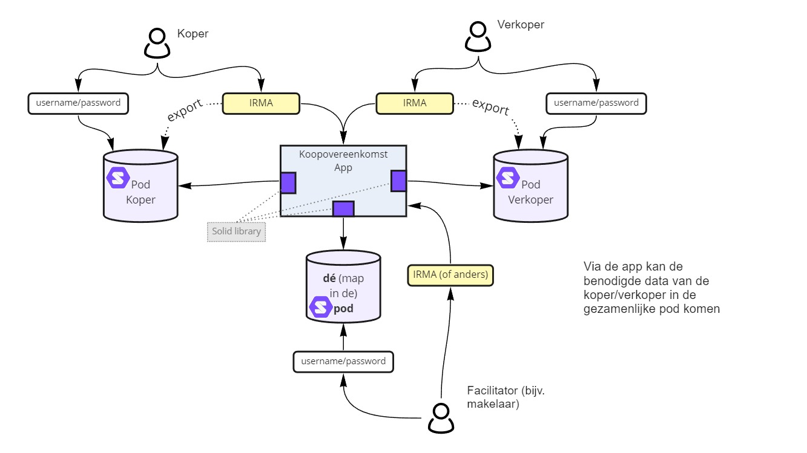

# Demonstrator Koopovereenkomst Solid App

Deze folder bevat (een eerste opzet voor) de **Demonstrator Koopovereenkomst Solid App**. Deze is bedoeld om kennis op te doen van hoe Solid PODs werken en hoe deze te gebruiken. In deze demonstator wordt een vereenvoudigde koopovereenkomst gesloten tussen Verkoper Vera en Koper Koos. Makelaar Mike faciliteert het proces en heeft de verantwoordelijkheid om het proces te initiëren, info toe te voegen die telefonisch of mondeling tussen verkoper en koper tot stand komt.

## Architectuur



Voor de demonstrator is alleen een WebApp / UserInterface benodigd en geen backends of iets dergelijks. Uiteraard wel de drie Solid PODs ... maar deze kunnen overal gestart worden. De demonstrator bevat scripts om de verschillende Solid PODs lokaal op te starten, testdata om daarin te laden en/of te gebruiken voor demonstraties én de daadwerkelijke Koopovereenkomst (Web)App.


## Proces

Het proces dat doorlopen wordt, is basaal als volgt:

1. Makelaar Mike initieert een nieuwe koopovereenkomst in de [Koopovereenkomst App]. Om dat te kunnen doen faciliteert hij (als makelaarskantoor) met een Solid POD tbv opslag en verzameling van deze koopovereenkomst: de POD Makelaarskantoor
1. Verkoper Vera ontvangt een link waarmee zij haar gegevens kan invullen in de koopovereenkomst en haar eigen Solid POD kan koppelen. Door deze link krijgt zij automatisch de rol van 'verkoper'
1. Koper Koos ontvangen een link waarmee hij zijn gegevens kan invullen in de koopovereenkomst en zijn eigen Solid POD kan koppelen. Door deze link krijgt hij automatisch de rol 'koper'
1. Als alles compleet is, kan Makelaar Mike de koopovereenkomst 'bevriezen' en een 'vastgestelde koopovereenkomst' genereren. In deze stap worden de gebruikte gegevens opgehaald en opgeslagen in de Solid POD van het makelaarskantoor omdat niet kan worden gegarandeerd dan één van de partijen tussentijds nog wijzigingen in zijn/haar POD doet.
1. Als elke partij getekend heeft, kan de koopovereenkomst afgerond worden. Dat betekent dat elke partij een specifieke 'afschrift' ontvangen, welke opgeslagen wordt in zijn/haar POD. De complete koopovereenkomst zou dan gedeeld moeten worden met de notaris tbv de uiteindelijke levering en kan optioneel ingeschreven worden in het Openbaar Register.

Bovenstaande is in detail uitgewerkt in een [Sequence Diagram](https://raw.githubusercontent.com/marcvanandel/solid-quest/main/demonstrator-koopovereenkomst-solid-app/koopovereenkomst-sequencediagram.png) (gemaakt mbv [SequenceDiagram.org](https://sequencediagram.org/) en [koopovereenkomst-sequencediagram.txt](koopovereenkomst-sequencediagram.txt))

## Techniek

Voor de realisatie van de Koopovereenkomst App is gekozen voor Typescript en [React](https://reactjs.org/). Het framework wat deze combinatie snel en gemakkelijk maakt en ook gebruikt is, is [Gatsby](https://www.gatsbyjs.com/). (zie ook issue #4)

----

<p align="center">
  <a href="https://www.gatsbyjs.com/?utm_source=starter&utm_medium=readme&utm_campaign=minimal-starter-ts">
    
  </a>
</p>
<h1 align="center">
  Gatsby minimal TypeScript starter
</h1>

### 🚀 Quick start

1.  **Create a Gatsby site.**

    Use the Gatsby CLI to create a new site, specifying the minimal TypeScript starter.

    ```shell
    # create a new Gatsby site using the minimal TypeScript starter
    npm init gatsby
    ```

2.  **Start developing.**

    Navigate into your new site’s directory and start it up.

    ```shell
    cd my-gatsby-site/
    npm run develop
    ```

3.  **Open the code and start customizing!**

    Your site is now running at http://localhost:8000!

    Edit `src/pages/index.tsx` to see your site update in real-time!

4.  **Learn more**

    - [Documentation](https://www.gatsbyjs.com/docs/?utm_source=starter&utm_medium=readme&utm_campaign=minimal-starter-ts)

    - [Tutorials](https://www.gatsbyjs.com/tutorial/?utm_source=starter&utm_medium=readme&utm_campaign=minimal-starter-ts)

    - [Guides](https://www.gatsbyjs.com/tutorial/?utm_source=starter&utm_medium=readme&utm_campaign=minimal-starter-ts)

    - [API Reference](https://www.gatsbyjs.com/docs/api-reference/?utm_source=starter&utm_medium=readme&utm_campaign=minimal-starter-ts)

    - [Plugin Library](https://www.gatsbyjs.com/plugins?utm_source=starter&utm_medium=readme&utm_campaign=minimal-starter-ts)

    - [Cheat Sheet](https://www.gatsbyjs.com/docs/cheat-sheet/?utm_source=starter&utm_medium=readme&utm_campaign=minimal-starter-ts)

### 🚀 Quick start (Gatsby Cloud)

Deploy this starter with one click on [Gatsby Cloud](https://www.gatsbyjs.com/cloud/):

[](https://www.gatsbyjs.com/dashboard/deploynow?url=https://github.com/gatsbyjs/gatsby-starter-minimal-ts)
